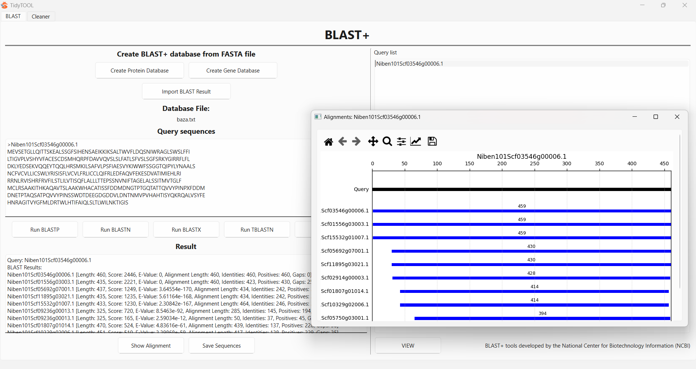

# TidyTool

**TidyTool** is a user-friendly, graphical application designed to facilitate working with sequence databases, especially for researchers without advanced bioinformatics skills. It provides a powerful and intuitive **PyQt6-based GUI** for:

- Removing duplicate sequences,
- Filtering sequences by name, length, or similarity,
- Parsing and visualizing BLAST results,
- Displaying histograms for score, E-value, and sequence length.

---


---

## Features
**BLAST+**:
- Load multiple FASTA files at once for creating BLAST database
- Run BLASTP, BLASTN, BLASTX, TBLASTN or TBLASTX
- Show Alignments (BLAST output file, -outfrm 0)
- Show Alignment coverage plots
- Export FASTA file with BLAST headers for further analyse in "Clean" tab

**Cleaner**:
- Load multiple FASTA files at once
- Remove duplicates (by name, sequence, or both)
- Filter sequences based on:
  - Name (partial or full match),
  - Sequence similarity (custom threshold),
  - Length range (min/max),
  - Start codon (`M` for proteins, `ATG` for genes),
  - Score, E-value, Alignment Length, Identity, Similarity (parsed from BLAST headers)
- Interactive histogram display:
  - Length
  - Score
  - E-value
  - Alignment Length
  - Identity
  - Similarity
- Export selected sequences to a FASTA file
- Right-click on a sequence → see full FASTA in a copyable popup

---

## Requirements

- Python `>=3.12`
- `PyQt6`
- `matplotlib`
- `sqlite3` (built into Python)
  
Install dependencies:

Windows:
- Download installer:
https://www.python.org/downloads/windows/
Choose Python 3.12.x and download 64-bit version.

- Run installer
SELECT "Add Python 3.12 to PATH" (very important).
- Click "Install Now"

- Open TidyTool folder
- Press the right mouse button and select "Open in Terminal"
- Paste commands:
```bash
pip install -r requirements.txt
```
- After installation type:
```bash
python main.py
```

Linux:
```bash
sudo apt install python3-pyqt6 python3-matplotlib
```
Mac:
```bash
pip3 install -r requirements.txt
```
---

## How to Run

1. Launch the app:

Windows:
```bash
python main.py
```
Linux:
```bash
python3 main.py
```
Mac:
```bash
python3 main.py
```

2. In the **BLAST** tab:
   - Choose a FASTA file to create BLAST database (Protein or Nucleotide),
   - Paste query sequences in Query box,
   - Run suitable BLAST search (BLASTP, BLASTN, BLASTX, TBLAXTN, TBLASTN),
   - Click on **Show Alignment** to open full BLAST result,
   - Select query in Query List and click on **View** to open Alignment coverage plot,
   - Click on **Save sequences** to create FASTA file (contains headers combined with BLAST data and belonging sequences).
3. In the **Cleaner** tab:
   - Click **Choose FASTA File** and select `.fasta` files,
   - You can preview the files you selected by clicking the **Show Files** button,
   - Select the method for removing duplicates:
     - Names (removes sequences with the same headers),
     - Sequences (removes identical sequences),
     - None selected (does not remove duplicates),
   - Click **Clean/Analyse** to start analyzing the selected files,
   - The headers will appear in the **Genes** window,
   if a file containing integrated BLAST information is loaded, the Score and E-value histograms will be generated automatically.
   - You can choose which histogram to display in each of the three panels by clicking the corresponding buttons,
   - You can choose which filter to apply by clicking the corresponding checkbox next to its name,
   - After entering the filter parameters, click the **Filter** button to display only the sequences that match the selected filters,
   - Selected genes can be highlighted in the **Genes** list and moved to the **Selected names** list using the **ADD** button,
   - By clicking the **Save FASTA** button, you save the genes from the **Selected names** list as a new FASTA file.


---

## Folder Structure

```
.
├── libraries
├	├── blast_parser.py         # BLAST XML parsing
├	├── blast_utils.py          # BLAST execution
├	├── blast_view.py           # BLAST plot view
├	├── draw_utils.py           # plotting logic
├	├── fasta_utils.py          # FASTA logic
├	├── gui.py                  # main GUI
├	├── move_utils.py           # list management helpers
├	├── thread_utils.py         # background threads
├── BLAST
├	├── blastn.exe
├	├── blastn
├	├── blastp.exe
├	├── blastp
├	├── blastx.exe
├	├── blastx
├	├── tblastx.exe
├	├── tblastx
├	├── tblastn.exe
├	├── tblastn
├	├── makeblastdb.exe
├	├── makeblastdb
├	├── blast_formatter.exe
├	├── blast_formatter
├	├── ncbi-vdb-md.dll
├	├── nghttp2.dll
├── database
├	├── database_here.txt
├── resources
├	├── tidytool.png
├── main.py
├── requirements.txt
├── LICENCE
├── NCBI_LICENCE
└── README.md
```

---

## Sample Data

You can use any FASTA-formatted files containing protein or gene sequences.
We recommend UniProt, Ensembl, or NCBI RefSeq for testing.

---

## Authors

- Aleksandra Liszka
- Aleksandra Marcisz
- Artur Stołowski

---

This application uses BLAST+ tools developed by the National Center for Biotechnology Information (NCBI).
https://blast.ncbi.nlm.nih.gov/

## License

MIT License

Copyright (c) 2025 Aleksandra Liszka, Artur Stołowski, Aleksandra Marcisz

Permission is hereby granted, free of charge, to any person obtaining a copy
of this software and associated documentation files (the "Software"), to deal
in the Software without restriction, including without limitation the rights
to use, copy, modify, merge, publish, distribute, sublicense, and/or sell
copies of the Software, and to permit persons to whom the Software is
furnished to do so, subject to the following conditions:

The above copyright notice and this permission notice shall be included in all
copies or substantial portions of the Software.

THE SOFTWARE IS PROVIDED "AS IS", WITHOUT WARRANTY OF ANY KIND, EXPRESS OR
IMPLIED, INCLUDING BUT NOT LIMITED TO THE WARRANTIES OF MERCHANTABILITY,
FITNESS FOR A PARTICULAR PURPOSE AND NONINFRINGEMENT. IN NO EVENT SHALL THE
AUTHORS OR COPYRIGHT HOLDERS BE LIABLE FOR ANY CLAIM, DAMAGES OR OTHER
LIABILITY, WHETHER IN AN ACTION OF CONTRACT, TORT OR OTHERWISE, ARISING FROM,
OUT OF OR IN CONNECTION WITH THE SOFTWARE OR THE USE OR OTHER DEALINGS IN THE
SOFTWARE.
